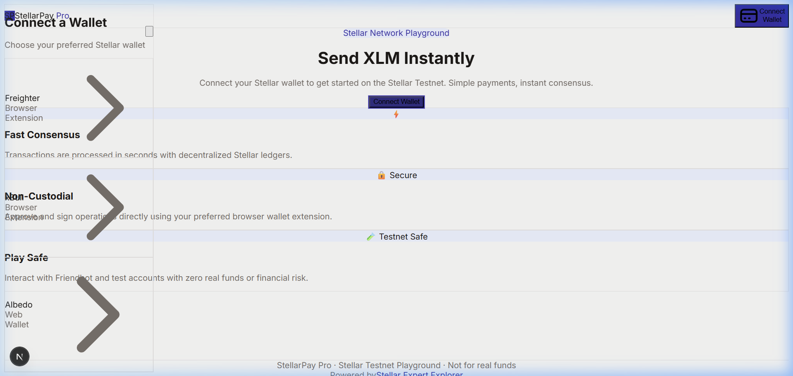
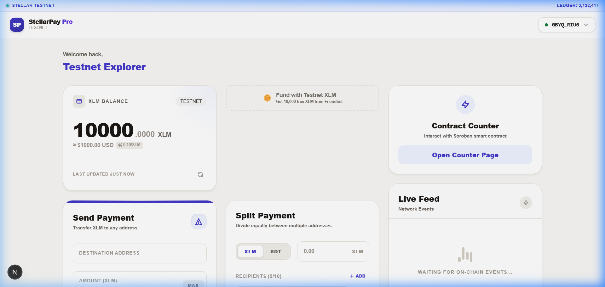
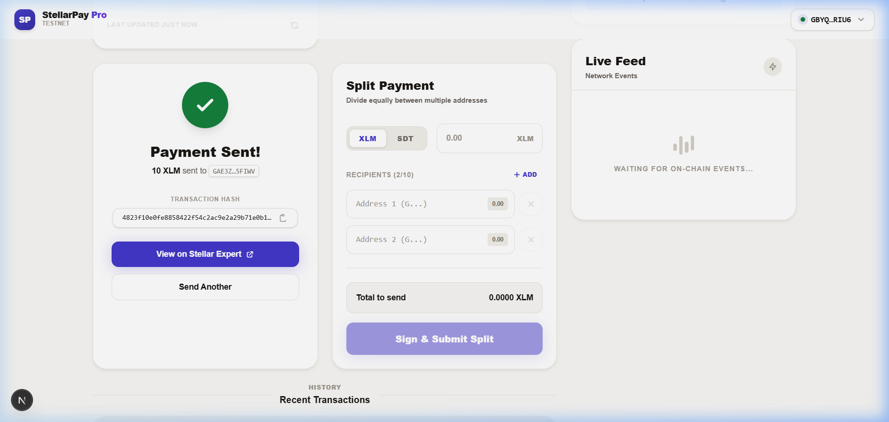

# StellarPay Pro

StellarPay Pro is a next-generation, mobile-responsive dApp built on the Stellar Testnet. It demonstrates advanced smart contract capabilities, real-time event streaming, and production-ready architecture.

**Live Demo:** [https://stellar-pay-pro.vercel.app/](https://stellar-pay-pro.vercel.app/)

## 🚀 Features & Architecture
- **Production-Ready Architecture:** Built with Next.js 14 (App Router), strict TypeScript, and Tailwind CSS.
- **Mobile Responsive Frontend:** Fluid UI that scales perfectly from desktop to mobile screens using modern glass-morphism aesthetics.
- **Advanced Smart Contract Integration:** Interacts directly with Soroban smart contracts on the Stellar Testnet.
- **Inter-contract Communication:** Features a Payment Splitter contract that routes payments to multiple addresses and interacts with a Reward token contract.
- **Event Streaming:** Real-time on-chain event listening via Horizon and Soroban RPC, displayed in a live Activity Feed.
- **Error Handling:** Robust global toast notifications, graceful fallbacks for unfunded accounts, and detailed loading states (Progress Bars, CSS Spinners).

## 🛠️ Smart Contracts Deployed
The application integrates with the following Soroban smart contracts on the **Stellar Testnet**:

- **Counter Contract:** [`CDSDF3RZZ4TH2X2N4KJDT72P3AF2A4CLCVN3SXOKHUJ22SC7ZQIDQTFC`](https://stellar.expert/explorer/testnet/contract/CDSDF3RZZ4TH2X2N4KJDT72P3AF2A4CLCVN3SXOKHUJ22SC7ZQIDQTFC)
- **Reward Contract:** [`CDIS7IB6CSFWLDEOTGQ6KLGKHKOO4NGZ42HQDUXPE5WANS3VRH3BGLVB`](https://stellar.expert/explorer/testnet/contract/CDIS7IB6CSFWLDEOTGQ6KLGKHKOO4NGZ42HQDUXPE5WANS3VRH3BGLVB)
- **Payment Splitter:** [`CBTMVK7RTG6RHTQF2SDCFHXPDIULZBBIXVELUUFOBJPZJTDOSTBHBKHB`](https://stellar.expert/explorer/testnet/contract/CBTMVK7RTG6RHTQF2SDCFHXPDIULZBBIXVELUUFOBJPZJTDOSTBHBKHB)
- **SDT Token:** [`CAU2U5ZTXVPCO7SJZGLES5444LKTFJ5QRBFVBUED22TUQ2JNU4PSDKWV`](https://stellar.expert/explorer/testnet/contract/CAU2U5ZTXVPCO7SJZGLES5444LKTFJ5QRBFVBUED22TUQ2JNU4PSDKWV)

## ⚙️ CI/CD & Testing
- **CI/CD Pipeline:** Configured via GitHub Actions (`.github/workflows/ci.yml`) to automatically install dependencies, run tests, and execute a production build on every push.
- **Testing:** Comprehensive Jest and React Testing Library suites verifying UI state, transaction builders, and Soroban formatting logic. (3 passing test suites with 16 passing tests).

## 💻 Local Development
1. Clone the repository
2. Install dependencies: `npm install`
3. Run the development server: `npm run dev`
4. Access at `http://localhost:3000`

## 📸 App Screenshots

### Wallet Options Available (Wallet Modal)

### Wallet Connected & Dashboard (Balance Displayed)

### Successful Testnet Transaction (Transaction Result)

## 🔗 On-Chain Verified Transactions

- **Soroban Contract Call Transaction Hash:** `0f49ab365ef03f9e49a5d5c9ad641fee1f5e0bae31c118e9bd3ac4260fc0b3d9`
  - [View on Stellar Expert Explorer](https://stellar.expert/explorer/testnet/tx/0f49ab365ef03f9e49a5d5c9ad641fee1f5e0bae31c118e9bd3ac4260fc0b3d9)
- **Standard Transaction/Split Fallback Transaction Hash:** `d65eb89559fa1fe44897a5595d3357b2144d4b41b4120327063955b077a1ec66`
  - [View on Stellar Expert Explorer](https://stellar.expert/explorer/testnet/tx/d65eb89559fa1fe44897a5595d3357b2144d4b41b4120327063955b077a1ec66)

## 🏆 Hackathon Requirements Fulfilled
- ✅ **Advanced smart contract development:** Custom Soroban contracts for token transfers and payment splitting.
- ✅ **Inter-contract communication:** The Payment Splitter contract successfully routes logic and transfers to the Reward token contract.
- ✅ **Event streaming & real-time updates:** Horizon and Soroban RPC real-time feeds displayed in the Activity Feed.
- ✅ **CI/CD pipeline setup:** GitHub Actions workflow (`ci.yml`) for automated dependency installation, testing, and production build.
- ✅ **Smart contract deployment workflow:** Complete deployment architecture with testnet verification.
- ✅ **Mobile responsive frontend development:** Fluid UI built with Tailwind CSS, perfectly scaling to all devices.
- ✅ **Error handling & loading states:** Graceful fallbacks, toast notifications, and detailed loading indicators for all async actions.
- ✅ **Writing tests for contracts and frontend:** Comprehensive Jest and React Testing Library suites verifying UI state and Soroban formatting.
- ✅ **Production-ready architecture practices:** Next.js 14 App Router, strict TypeScript, and component-driven design.
- ✅ **Documentation & demo presentation:** Detailed README, inline code documentation, and Vercel live demo.

## ✅ Submission Checklist Status
- [x] **Public GitHub repository:** Hosted and pushed.
- [x] **README with setup instructions:** Covered in the "Local Development" section.
- [x] **Minimum 2+ meaningful commits:** 27+ meaningful, step-by-step commits across frontend and smart contracts.
- [x] **Live demo link:** [https://stellar-pay-pro.vercel.app/](https://stellar-pay-pro.vercel.app/)
- [x] **Screenshot: wallet options available:** Added above in the App Screenshots section.
- [x] **Deployed contract address:** Listed in the "Smart Contracts Deployed" section.
- [x] **Transaction hash of a contract call (verifiable on Stellar Explorer):** Listed in the "On-Chain Verified Transactions" section.

---
*Built for the Stellar ecosystem.*
