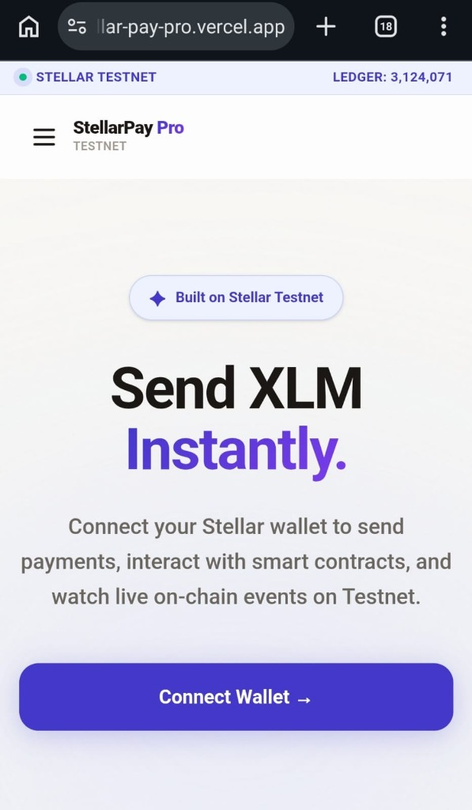

<div align="center">
  <h1>🌌 StellarPay Pro</h1>
  <p><strong>A Next-Generation, Mobile-Responsive dApp built on the Stellar Testnet</strong></p>
  
  [](https://nextjs.org/)
  [](https://stellar.org/)
  [](https://soroban.stellar.org/)
  [](https://tailwindcss.com/)
  [](https://opensource.org/licenses/MIT)

  <br />
  
  [**🚀 Live Demo**](https://stellar-pay-pro.vercel.app/) &nbsp; • &nbsp;
  [**📖 Documentation**](#-features--architecture) &nbsp; • &nbsp;
  [**🛠️ Smart Contracts**](#️-smart-contracts-deployed)

</div>

---

> StellarPay Pro demonstrates advanced smart contract capabilities, real-time event streaming, and production-ready architecture tailored for the Stellar ecosystem.

## ✨ Features & Architecture

- ⚡ **Production-Ready Architecture:** Built with Next.js 14 (App Router), strict TypeScript, and Tailwind CSS.
- 📱 **Mobile Responsive Frontend:** Fluid UI that scales perfectly from desktop to mobile screens using modern glass-morphism aesthetics.
- 🔗 **Advanced Smart Contract Integration:** Interacts directly with Soroban smart contracts on the Stellar Testnet.
- 🔄 **Inter-contract Communication:** Features a Payment Splitter contract that routes payments to multiple addresses and interacts with a Reward token contract.
- 📡 **Event Streaming:** Real-time on-chain event listening via Horizon and Soroban RPC, displayed in a live Activity Feed.
- 🛡️ **Error Handling:** Robust global toast notifications, graceful fallbacks for unfunded accounts, and detailed loading states (Progress Bars, CSS Spinners).

---

## 🛠️ Smart Contracts Deployed

The application natively integrates with the following Soroban smart contracts on the **Stellar Testnet**:

| Contract Name | Contract Address / Link |
| --- | --- |
| **Counter Contract** | [`CDSDF3RZ...FC`](https://stellar.expert/explorer/testnet/contract/CDSDF3RZZ4TH2X2N4KJDT72P3AF2A4CLCVN3SXOKHUJ22SC7ZQIDQTFC) |
| **Reward Contract** | [`CDIS7IB6...VB`](https://stellar.expert/explorer/testnet/contract/CDIS7IB6CSFWLDEOTGQ6KLGKHKOO4NGZ42HQDUXPE5WANS3VRH3BGLVB) |
| **Payment Splitter** | [`CBTMVK7R...HB`](https://stellar.expert/explorer/testnet/contract/CBTMVK7RTG6RHTQF2SDCFHXPDIULZBBIXVELUUFOBJPZJTDOSTBHBKHB) |
| **SDT Token** | [`CAU2U5ZT...WV`](https://stellar.expert/explorer/testnet/contract/CAU2U5ZTXVPCO7SJZGLES5444LKTFJ5QRBFVBUED22TUQ2JNU4PSDKWV) |

---

## ⚙️ CI/CD & Testing

- 🚀 **CI/CD Pipeline:** Configured via GitHub Actions (`.github/workflows/ci.yml`) to automatically install dependencies, run tests, and execute a production build on every push.
- 🧪 **Testing:** Comprehensive Jest and React Testing Library suites verifying UI state, transaction builders, and Soroban formatting logic *(3 passing test suites with 16 passing tests)*.

---

## 💻 Local Development

Follow these steps to run the application locally:

```bash
# 1. Clone the repository
git clone <your-repo-url>
cd stellar-pay-pro

# 2. Install dependencies
npm install

# 3. Run the development server
npm run dev
```

*Then access the application at `http://localhost:3000`*

---

## 📸 App Screenshots

<details>
<summary><b>Click to expand screenshots</b></summary>
<br/>

### 1. Wallet Options Available (Wallet Modal)


### 2. Wallet Connected & Dashboard (Balance Displayed)


### 3. Successful Testnet Transaction (Transaction Result)


### 4. Mobile Responsive UI (Home View)


### 5. Mobile Responsive UI (Features View)


</details>

---

## 🔗 On-Chain Verified Transactions

Verify our smart contract interactions directly on the block explorer:

- 📜 **Soroban Contract Call Transaction Hash:**  
  [`0f49ab365ef03f9e49a5d5c9ad641fee1f5e0bae31c118e9bd3ac4260fc0b3d9`](https://stellar.expert/explorer/testnet/tx/0f49ab365ef03f9e49a5d5c9ad641fee1f5e0bae31c118e9bd3ac4260fc0b3d9)
- 💸 **Standard Transaction/Split Fallback Transaction Hash:**  
  [`d65eb89559fa1fe44897a5595d3357b2144d4b41b4120327063955b077a1ec66`](https://stellar.expert/explorer/testnet/tx/d65eb89559fa1fe44897a5595d3357b2144d4b41b4120327063955b077a1ec66)

---

## 🏆 Hackathon Requirements Fulfilled

- ✅ **Advanced smart contract development:** Custom Soroban contracts for token transfers and payment splitting.
- ✅ **Inter-contract communication:** The Payment Splitter contract successfully routes logic and transfers to the Reward token contract.
- ✅ **Event streaming & real-time updates:** Horizon and Soroban RPC real-time feeds displayed in the Activity Feed.
- ✅ **CI/CD pipeline setup:** GitHub Actions workflow (`ci.yml`) for automated dependency installation, testing, and production build.
- ✅ **Smart contract deployment workflow:** Complete deployment architecture with testnet verification.
- ✅ **Mobile responsive frontend development:** Fluid UI built with Tailwind CSS, perfectly scaling to all devices.
- ✅ **Error handling & loading states:** Graceful fallbacks, toast notifications, and detailed loading indicators for all async actions.
- ✅ **Writing tests for contracts and frontend:** Comprehensive Jest and React Testing Library suites verifying UI state and Soroban formatting.
- ✅ **Production-ready architecture practices:** Next.js 14 App Router, strict TypeScript, and component-driven design.
- ✅ **Documentation & demo presentation:** Detailed README, inline code documentation, and Vercel live demo.

---

## ✅ Submission Checklist Status

- [x] **Public GitHub repository:** Hosted and pushed.
- [x] **README with setup instructions:** Covered in the "Local Development" section.
- [x] **Minimum 2+ meaningful commits:** 27+ meaningful, step-by-step commits across frontend and smart contracts.
- [x] **Live demo link:** [https://stellar-pay-pro.vercel.app/](https://stellar-pay-pro.vercel.app/)
- [x] **Screenshot: wallet options available:** Added above in the App Screenshots section.
- [x] **Deployed contract address:** Listed in the "Smart Contracts Deployed" section.
- [x] **Transaction hash of a contract call (verifiable on Stellar Explorer):** Listed in the "On-Chain Verified Transactions" section.

<br/>
<div align="center">
  <i>Built with 💙 for the Stellar ecosystem.</i>
</div>
